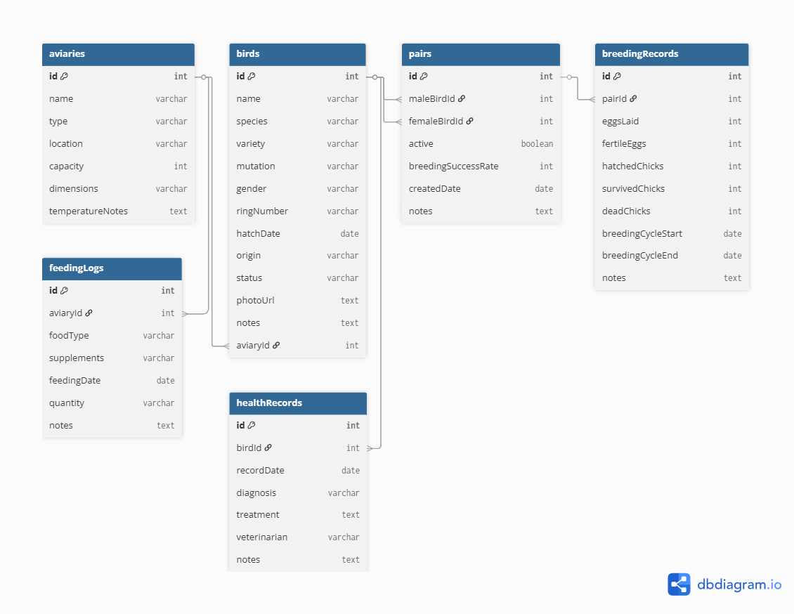

# 🦜 Nest - Správa ptačích voliér

Webová aplikace pro správu ptačích voliér, chovných párů, zdravotních záznamů a krmení. Projekt zároveň slouží jako základní skeleton pro bakalářskou práci a počítá s dalším rozšiřováním funkcí i vizuální vrstvy. Postavena na Vue 3, PrimeVue v4 a TailwindCSS v4.

> ⚠️ **Poznámka:**  
> Aplikace aktuálně používá pouze generovaná a ručně vytvořená testovací data (`db.json`).  
> Datový model, statistiky i záznamy zatím nebyly ověřeny v reálném provozu chovu a slouží hlavně pro návrh struktury aplikace, UI a budoucí rozšíření projektu.

---

## ✨ Co aplikace umí

- **Přehled (Dashboard)** - rychlý souhrn všech ptáků, aktivních hnízdění a poslední aktivity
- **Správa ptáků** - přidávání, úprava a mazání ptáků; výběr odrůdy a mutace podle druhu; dynamický výpočet věku; filtrování a stránkování
- **Voliéry** - přehled voliér s barevným ukazatelem obsazenosti; upozornění při přeplnění
- **Chovné páry** - zakládání párů, přehled jejich historiky a výpočet úspěšnosti odchovu
- **Záznamy o hnízdění** - sledování celého cyklu: vajíčka -> vykulená -> přeživší -> uhynulá
- **Krmení** - záznamy o krmení podle voliér, typy krmiva, doplňky stravy
- **Zdravotní záznamy** - evidence nemocí, zranění, prohlídek a léčby pro každého ptáka
- **Statistiky** - interaktivní grafy (zastoupení druhů, trendy hnízdění, zdravotní problémy, obsazenost voliér)
- **Nastavení** - přepínání světlého/tmavého motivu, výběr jazyka (čeština/angličtina), export a import dat
- **Vícejazyčnost** - čeština (výchozí) a angličtina přes Vue I18n
- **Responzivní rozvržení** - postranní navigace s fixní hlavičkou

---

## 🎓 Kontext projektu

Tenhle projekt beru jako základ pro bakalářku. Teď funguje hlavně jako první použitelná verze, na které si stavím správu ptáků, voliér, krmení, zdraví a dalších záznamů kolem chovu.

Zároveň to vychází z úplně běžné reality kolem chovatelů. Spousta z nich si podobné věci pořád píše na papír, do sešitů nebo různě po poznámkách, a pak je složité se v tom vyznat, něco zpětně dohledat nebo všechno pořád přepisovat a upravovat. Přesně tohle jsem viděl i doma, dřív u dědy a teď i u taťky, takže mi dává smysl zkusit to převést do přehlednější digitální podoby.

Cíl není udělat z toho zbytečně složitý systém, ale mít praktickou aplikaci, která se bude dát postupně rozšiřovat o další nápady. Do budoucna bych chtěl přidat víc vizuálních prvků, lepší přehled nad rozložením chovu a celkově to posunout blíž reálnému používání.

Počítám také s tím, že by aplikace měla jednou fungovat co nejvíc jednoduše nad JSON daty, protože každý uživatel bude mít spíš menší množství záznamů. Díky tomu by to mohlo v budoucnu dobře fungovat i offline, třeba v telefonu. Přihlášení by pak nebylo kvůli nějakému složitému backendu, ale hlavně kvůli synchronizaci, aktualizaci a ukládání dat mezi zařízeními.

---

## 🛠 Použité technologie

| Vrstva             | Technologie                               |
| ------------------ | ----------------------------------------- |
| Frontend framework | Vue 3 (Composition API, `<script setup>`) |
| UI komponenty      | PrimeVue v4 s Aura předvolbou             |
| CSS framework      | TailwindCSS v4                            |
| Směrování          | Vue Router 4                              |
| Překlady           | Vue I18n v9                               |
| HTTP klient        | Axios                                     |
| Backend / mock API | JSON Server                               |
| Sestavení projektu | Vite                                      |

---

## 📁 Struktura projektu

```
src/
├── assets/
│   ├── base.css          # Globální CSS reset a proměnné
│   └── main.css          # Styly aplikace, třídy pro odznaky, tmavý motiv
├── components/
│   ├── DeleteConfirmDialog.vue  # Potvrzovací dialog před smazáním
│   ├── EmptyState.vue           # Zobrazen, když nejsou žádná data
│   ├── OccupancyBar.vue         # Barevný ukazatel obsazenosti voliéry
│   ├── StatCard.vue             # Karta s metrikou pro dashboard
│   └── StatusBadge.vue          # Barevný odznak stavu
├── composables/
│   ├── useCrud.js        # Obecný composable pro CRUD operace (načítání/vytváření/úprava/mazání)
│   └── useTheme.js       # Logika přepínání tmavého motivu
├── constants/
│   └── index.js          # Konstanty celé aplikace: druhy, stavy, typy krmiva atd.
├── locales/
│   ├── cs.json           # České překlady
│   └── en.json           # Anglické překlady
├── router/
│   └── index.js          # Definice tras Vue Routeru
├── services/
│   └── api.js            # Axios API služby (jeden objekt pro každou entitu)
├── utils/
│   └── index.js          # Sdílené pomocné funkce
└── views/
    ├── DashboardView.vue
    ├── BirdsView.vue
    ├── AviariesView.vue
    ├── PairsView.vue
    ├── BreedingView.vue
    ├── FeedingView.vue
    ├── HealthView.vue
    ├── StatisticsView.vue
    └── SettingsView.vue
```

---

## 🗄 Datový model

Aplikace používá JSON Server jako simulovaný REST backend. Databáze (`db.json`) obsahuje tyto entity:



### `birds` - ptáci

| Pole       | Typ    | Popis                                                             |
| ---------- | ------ | ----------------------------------------------------------------- |
| id         | number | Jedinečný identifikátor                                           |
| name       | string | Jméno ptáka                                                       |
| species    | string | Druh, např. „Andulka", „Korela", „Rosela", „Kanár"                |
| variety    | string | Odrůda specifická pro daný druh                                   |
| mutation   | string | Barevná mutace                                                    |
| gender     | string | „samec" / „samice" / „neznámé"                                    |
| status     | string | „aktivní" / „neaktivní" / „karanténa" / „prodáno" / „zemřelý"     |
| ringNumber | string | Číslo kroužku                                                     |
| aviaryId   | number | Cizí klíč -> voliéry                                              |
| hatchDate  | date   | Datum vylíhnutí (věk se vždy počítá dynamicky, nikdy se neukládá) |
| origin     | string | Původ / chovatel                                                  |
| notes      | string | Volné poznámky                                                    |

> **Poznámka:** Věk ptáka se nikdy neukládá - vždy se dynamicky dopočítává z `hatchDate`.

### `aviaries` - voliéry

| Pole             | Typ    | Popis                            |
| ---------------- | ------ | -------------------------------- |
| id               | number | Jedinečný identifikátor          |
| name             | string | Název voliéry                    |
| type             | string | „Vnitřní" / „Venkovní" / „Sklep" |
| capacity         | number | Maximální kapacita ptáků         |
| dimensions       | string | Rozměry, např. „2x2x3m"          |
| temperatureNotes | string | Poznámky k teplotě / klimatu     |

> **Poznámka:** Aktuální obsazenost se nikdy neukládá - počítá se dynamicky podle aktivních ptáků v dané voliéře.

### `pairs` - chovné páry

| Pole         | Typ     | Popis                       |
| ------------ | ------- | --------------------------- |
| id           | number  | Jedinečný identifikátor     |
| maleBirdId   | number  | Cizí klíč -> ptáci (samec)  |
| femaleBirdId | number  | Cizí klíč -> ptáci (samice) |
| active       | boolean | Je pár aktuálně aktivní?    |
| notes        | string  | Poznámky                    |

### `breedingRecords` - záznamy o hnízdění

| Pole               | Typ    | Popis                                       |
| ------------------ | ------ | ------------------------------------------- |
| id                 | number | Jedinečný identifikátor                     |
| pairId             | number | Cizí klíč -> páry                           |
| eggsLaid           | number | Celkový počet snesených vajec               |
| fertileEggs        | number | Počet oplodněných vajec                     |
| hatchedChicks      | number | Počet vykulených mláďat                     |
| survivedChicks     | number | Počet přeživších mláďat                     |
| deadChicks         | number | Počet uhynulých mláďat                      |
| breedingCycleStart | date   | Začátek chovného cyklu                      |
| breedingCycleEnd   | date   | Konec chovného cyklu (null = stále probíhá) |
| notes              | string | Poznámky                                    |

### `healthRecords` - zdravotní záznamy

| Pole        | Typ    | Popis                                                  |
| ----------- | ------ | ------------------------------------------------------ |
| id          | number | Jedinečný identifikátor                                |
| birdId      | number | Cizí klíč -> ptáci                                     |
| type        | string | „Prohlídka" / „Zranění" / „Nemoc" / „Léky" / „Operace" |
| date        | date   | Datum záznamu                                          |
| description | string | Popis                                                  |
| medications | string | Předepsané léky                                        |
| vet         | string | Jméno veterináře                                       |
| notes       | string | Další poznámky                                         |

### `feedingLogs` - záznamy o krmení

| Pole        | Typ    | Popis                                     |
| ----------- | ------ | ----------------------------------------- |
| id          | number | Jedinečný identifikátor                   |
| aviaryId    | number | Cizí klíč -> voliéry                      |
| foodType    | string | Typ krmiva, např. „Směs semen", „Peletky" |
| quantity    | string | Množství, např. „200g"                    |
| supplements | string | Doplňky stravy                            |
| feedingDate | date   | Datum krmení                              |
| notes       | string | Poznámky                                  |

---

## 🚀 Instalace a spuštění

### Požadavky

- Node.js 18+
- npm nebo yarn

### 1. Stáhněte projekt

```bash
git clone https://github.com/DaLukCZ/Nest
```

### 2. Instalace závislostí

```bash
npm install
```

### 3. Spuštění JSON Serveru (simulovaný backend)

```bash
json-server --watch db.json --port 3001
# Běží na http://localhost:3001
```

### 4. Spuštění vývojového serveru

```bash
npm run dev
# Běží na http://localhost:5173
```

Pro běh aplikace jsou potřeba dvě okna terminálu - jedno pro server a druhé pro frontend.

---

## 🏗 Architektura

### Konstanty (`src/constants/index.js`)

Všechny výčty a seznamy možností jsou definovány na jednom místě a importovány tam, kde jsou potřeba:

- `SPECIES`, `SPECIES_LIST` - druhy ptáků
- `SPECIES_VARIETIES`, `SPECIES_MUTATIONS` - odrůdy a mutace podle druhu
- `GENDER`, `BIRD_STATUS` - pohlaví a stavy ptáků
- `FOOD_TYPE_LIST`, `HEALTH_TYPE_LIST` - typy krmiva a zdravotních záznamů
- `OCCUPANCY_THRESHOLDS` - hranice pro bezpečnou / varovnou / nebezpečnou obsazenost

### Pomocné funkce (`src/utils/index.js`)

- `formatDate(dateString)` - formátování data podle lokalizace
- `calculateAge(hatchDate)` -> `{ months, years, label }` - věk se vždy počítá, nikdy neukládá
- `calcOccupancyPercent(current, capacity)` - procento obsazenosti voliéry
- `getOccupancySeverity(current, capacity)` -> `'safe'|'warning'|'danger'`
- `calcSuccessRate(breedingRecord)` - procento úspěšnosti odchovu
- `debounce(fn, delay)` - pomocná funkce pro zpoždění vyhledávání

### Obecný CRUD composable (`src/composables/useCrud.js`)

Odstraňuje opakující se kód ve views. Stačí zavolat `useCrud(apiService, { defaultForm })` a dostaneš:

- `items`, `loading`, `saving` - reaktivní stav
- `loadAll()`, `openCreate()`, `openEdit(item)`, `save()`, `remove(id)` - akce

### Znovupoužitelné komponenty

- **`StatusBadge`** - barevný odznak stavu (zelená/modrá/růžová/červená/oranžová/jantarová/šedá/fialová)
- **`StatCard`** - karta s metrikou, ikonou a barevným akcentem
- **`EmptyState`** - zobrazí se, když nejsou žádná data - obsahuje ikonu, titulek, popis a volitelný slot pro akci
- **`DeleteConfirmDialog`** - modální dialog nahrazující nativní `confirm()`
- **`OccupancyBar`** - barevný ukazatel obsazenosti voliéry

---

## 🔍 Systém filtrování

Každý pohled s tabulkou dat obsahuje:

- Debounced vyhledávací pole (zpoždění 300 ms)
- Vypočtený `filteredItems`, který prohledává relevantní textová pole
- Volitelné rozbalovací filtry pro druh nebo stav, kombinovatelné s textovým vyhledáváním

---

## ⏱️ Co by mohlo přijít dál

- [ ] Vizuální znázornění voliér a celé zahrady formou interaktivního layoutu
- [ ] Možnost vytvořit si v aplikaci "kopii" reálného rozmístění zahrady / chovu
- [ ] Přidání budek a dalších prvků vybavení do jednotlivých voliér
- [ ] Offline-first mobilní použití s lokálním JSON uložištěm
- [ ] Přihlašování uživatelů primárně pro synchronizaci, aktualizaci a ukládání dat
- [ ] Jednoduchá víceuživatelská podpora bez zbytečně komplexního backendu
- [ ] Push notifikace pro zdravotní připomínky
- [ ] Nahrávání fotek (aktuálně pouze URL)
- [ ] Pokročilé generování reportů (export do PDF / CSV)
- [ ] Kalendářní přehled chovných cyklů
- [ ] Rodokmen ptáků / sledování linie
- [ ] Automatické připomínky pro pravidelné zdravotní prohlídky

---

## 👤 Author

Developed by Lukáš Šmach.
